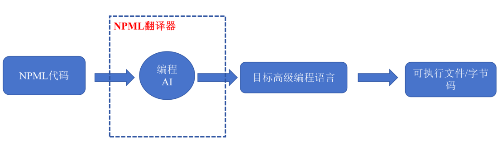
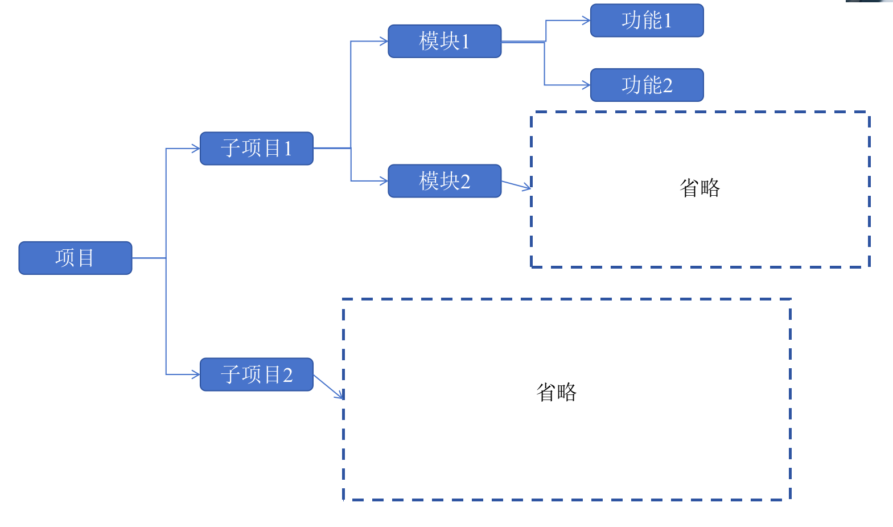

# 《LinguaForge | 万言熔炉》项目文档
版本：v2-exp-0.1

基于NPML的传播式AI编程工作流范式，实现多编程语言、框架统一，有效降低开发心智压力。

> - Lingua：源自拉丁语，意为“语言”
> - Forge：意为“锻造、熔铸”
> - 万言：中文中“万”代表众多
> - 熔炉：比喻多元融合、提炼精华的容器
> *powered by Qwen*

## 一、NPML

### 1.1 背景

大模型时代，AI编程、Vibe coding成为新型编程范式——采用自然语言与编程AI助手交流，实现编程任务。整体来看，该编程范式直接通过自然语言编程，间接地将自然语言提升为“编程语言”，极大地降低了开发门槛。

但是自然语言天生不是为编程服务的，换句话说，自然语言难以描述复杂的程序逻辑，自然语言的细腻程度难以在编程语境下掌握——是宏观地描述具体需要实现的功能？还是微观地描述功能如何实现？同时，自然语言的歧义性导致每次AI生成的代码程序是不一致的，即“自然语言编程”难以实现唯一性。

总的来说，自然语言编程有以下局限性：

1. 自然语言难以描述复杂程序逻辑；
2. 自然语言难以把握描述细腻程度；
3. 自然语言具有歧义，无法保证每次代码生成是确定的。

### 1.2 NPML目标

本项目为了解决1.1所述的3个自然语言编程局限性，提出一种介于自然语言和高级编程语言的新编程语言，或者说标记语言，命名为NP-middle-Language。该语言一定程度上可以视为编程语言，也可以称为标记语言，为了统一，本项目将该语言视为编程语言。

NP-Middle-Language（下文简称NPML）将混合自然语言和一定高级编程语言语法，理论上具备自然语言的自由性和高级编程语言的严谨性。NPML的目的是引导编程AI生成无歧义、确定的高级编程语言代码。

NPML与伪代码相似，但是NPML比高级编程语言更简单，比伪代码更灵活。


### 1.3 NPML翻译器

每门编程语言都有其编译器或者解释器，对于静态语言，一般通过编译器编译为可执行文件（C/C++、golang、rust）；对于动态语言，一般通过解释器翻译为字节码，在运行时上运行（java、python）。

NPML的编译器或者解释器直接来讲应该是AI本身，更具体一点：可生成目标高级编程语言的文字大模型。为了方便，本项目将该文字大模型称为编程AI。编程AI将NPML翻译为对应目标高级编程语言，然后调用该高级编程语言的编译器或者解释器。

NPML翻译器定义为：可以将NPML代码转化为目标编程语言的编程AI。



### 1.4 NPML语法

详见[这里](./prompts/npml.md)。

## 二、传播式AI编程工作流

传播式：功能需求逐步地、分层次地更新到工作流架构中，这个过程就像神经网络模型的数据传播。

### 2.1 工作流架构

工作流架构为：



项目、子项目、模块、功能的关系为：

项目包含多个子项目，子项目包含多个模块、模块包含多个功能。它们是嵌套包含关系。

项目、子项目、模块和功能在具体实现之前（编写代码之前）都以文档表示。

从项目到功能，其文档内容是从宏观到微观、概述到具体的。

例如：子项目1的文档中不会详细描述模块的具体定义、功能的具体定义，而是提供子项目概述和模块目录（即有哪些模块）。

#### 项目

项目包含如下内容：

- 项目名称：英文名称和中文名称
- 文档路径：以项目根目录为基础的相对路径，包括文件名
- 项目背景和核心目标（解决的问题）

- 项目技术栈
- 项目约束
- 项目级依赖
- 项目范围：包含和不包含的内容
- 子项目列表：子项目名称和概述
- 标签

- 子项目开发进度

#### 子项目

子项目包含如下内容：

- 子项目名称
- 文档路径：以项目根目录为基础的相对路径，包括文件名
- 子项目的核心目标
- 子项目所属父项目名称

- 子项目范围
- 模块列表：模块名称和概述

- 子项目约束
- 标签

- 模块开发进度

#### 模块

模块包含如下内容：

- 模块名称
- 文档路径：以项目根目录为基础的相对路径，包括文件名
- 模块的核心目标
- 模块所属子项目名称

- 模块范围
- 功能列表：功能名称和概述

- 模块技术栈
- 模块约束
- 标签

- 功能开发进度：功能是否开发完毕，该功能是否废弃

#### 功能（最具体、最小层次、实现单位）

功能包含如下内容：

- 功能名称
- 文档路径：以项目根目录为基础的相对路径，包括文件名

- 功能的类、函数、接口签名
- 功能的输入和输出：类型格式、示例
- 功能的具体行为逻辑：具体实现，自然语言描述
- 功能的异常情况和处理办法
- 功能的对应代码文件路径和名称

- 功能依赖关系：直接依赖的功能名称、概述和路径

- 功能测试
- 标签和关键词

#### 文档编写规范

所有文档严格按照上面的格式，不能多写或者少写，不要废话，简明扼要。

不要过度划分层次，例如一个小型项目划分为三四个子项目。一般情况下，小型项目只需要1-2个子项目，中大型项目以这个标准适当增加。

### 2.2 开发流程

#### 初始需求编写

在正式开启项目时，人类开发者（需求者）需要编写需求文档，即需要实现的功能，以自然语言描述，也可以包含具体的片段代码。

人类开发者最佳实践是，在需求文档中指明项目名称、项目核心目标和项目技术栈；依次有结构地描述需求功能。

#### 项目初始化

项目初始化是将所有的功能需求（需求文档）进行整理，转化为工作流架构（具体形式为文档）。

所有文档按照子项目文件夹-模块文件夹-功能文档的方式存储，例如：

```text
docs/
    project.md
    subproject-1/
        subproject-1.md
        module-1/
            module-1.md
            function/
                function-1.md
                function-2.md
                ...
        module-2/
            ...
    subproject-2/
        ...
```

注意到，整个工作流架构（又称工作流文档）是存储在项目的docs文件夹下的。

从初始的需求文档到工作流架构，称为**正向传播**。

#### 开发和上下文链

开发是按照`功能`为最小单位进行的。

开发时，需要向AI通过从项目到功能这个链路上的全部文档，将该链的文档路称为上下文链，例如：

参考上面的架构，开发function-1时，提供子项目1->模块1->功能1链路上的文档：subproject.md、module.md和function-1.md。

除了开发的功能的上下文链，还要提供功能的依赖功能的上下文链，将这些上下文链相同的文档合并（只保留一个文档），然后提交给AI。

AI根据上下文链编写代码实现功能。

#### 新功能添加

项目开发过程中会有新的功能、新的需求出现，将需求功能编写为需求文档后，交给AI进行正向传播，将新功能添加到架构中。

#### 增量功能和反向传播

增量功能指在某个已经存在的模块或者功能基础上进行修改，如重构、新功能添加、修改、删除。

将增量功能的需求文档正向传播到架构中，更新功能的文档。

功能的文档更新后，所属的模块、子项目、项目都**可能**需要更新，这个时候需要进行**反向传播**，更新上一层次的文档。

### 2.3 功能依赖

功能与功能之间有依赖关系，从上一层次来讲，就是模块与模块的依赖关系、子项目与子项目的关系，但最终还是要讨论功能与功能的依赖关系。

为了方便，只关注功能的直接依赖关系，不考虑间接依赖、被依赖关系（这些关系是由直接依赖关系得来的）。

#### 依赖检索

在正向传播过程中（项目初始化、新功能添加等），需要检索新功能的依赖关系，即从项目的已经存在的功能中检索出，与当前功能存在依赖关系的功能（注意是当前功能的直接依赖，不考虑间接依赖和被依赖关系），将这些功能添加到当前功能的依赖描述中。

采用分层检索的方式实现功能的依赖检索（与正向传播类似）：

在项目文档的子项目列表中找到与当前功能可能存在依赖关系的子项目名称（一个或者多个），然后分别查看这些子项目文档的模块列表，找到与当前功能可能存在依赖关系的模块名称；然后分别查看这些模块的功能列表，找到与当前功能可能存在依赖关系的功能名称；最后查看这些功能文档，确定是否与当前功能存在依赖关系，将确认的功能名称、路径和描述添加到当前功能文档的依赖描述中。


### 2.4 正向传播

项目初始化和新功能添加都需要正向传播。

AI获取需求文档后，从项目层次开始，查看项目文档中的子项目列表，判断该需求的所属子项目，然后打开匹配的子项目文档；查看子项目文档中的模块列表，判断该需求的所属模块，然后打开匹配的模块文档，添加该需求的功能文档。

在上面的过程中，如果没有匹配到层次，则创建一个新的层次，例如没有匹配的模块，则创建一个新的模块，将新功能添加进去；在这个过程中，还要修改检索传播链路上的文档，例如确定新功能是某个子项目的某个模块，则对应子项目文档和模块文档需要更新。

#### 层次命名规则

每个层次的文档命名规则为：`名称-层次名称`纯英文，例如一个名为前端的子项目`frontend-subproject`；一个名为用户登录的功能`login-function`。

特别地，项目文档的名称只能是：`project.md`。

### 2.5 反向传播

修改已经存在的功能时，需要反向传播；实现代码后，代码与原文档有出入，也需要反向传播（这种情况要避免）。

反向传播从某个功能文档开始，查看当前文档的路径，获取上一层次的路径，然后查看上一个层次的文档，判断是否需要修改。重复步骤直到最高层：项目文档。


## 三、工作流智能体

### 3.1 Agent任务

Agent有如下任务：

- 问答：根据当前工作流架构回答用户问题；
- 正向传播：根据用户的需求文档进行正向传播，更新工作流架构；
- 方向传播：根据用户的增量功能需求进行反向传播，由下至上更新工作流架构；
- 编码实现：根据上下文链编码实现功能；
- Debug：由用户反应代码出现bug错误，改正代码；
- 测试：编写测试代码实现测试。

#### 问答任务

Agent接收用户关于项目的问题，调用`文件查看`工具查看相关文件内容，然后回答用户问题。

#### 正向传播任务

Agent根据用户输入的需求文档，调用`文件查看`，`文件写入\修改`等工具实现正向传播。

#### 反向传播任务

Agent根据用户输入的增量功能需求文档，调用`文件查看`，`文件写入\修改`等工具实现反向传播。

#### 编码实现任务

Agent根据用户指定需要实现的功能名称（功能路径），调用`上下文链获取`,`文件查看`，`文件写入\修改`等工具完成功能编码实现。
注意实现后，看情况反向传播。代码文件的存储方式不用按照工作流的架构，这两者可以无关，但是在文档中必须目前代码文件路径。

#### Debug任务

Agent根据用户反映的某个已经实现的功能的代码错误、bug，修改代码解决bug错误。会调用`上下文链获取`,`文件查看`，`文件写入\修改`等工具。

#### 测试任务

Agent编写用户指定已经实现的功能的测试代码，会调用`上下文链获取`,`文件查看`，`文件写入\修改`等工具。

#### 任务结果输出

只不是调用工具，则按照下面格式输出任务结果：

```
<TASK NAME>
这里写入任务结果。
```

例如某次反向任务完成，则输出结果：

```
<反向传播>
反向传播完成。
更新文件有：
...
```

### 3.2 工具

#### 工具调用规范

Agent如果需要调用工具，必须按照如下格式输出工具调用请求：

```
<TOOL USE>
工具名称:这里填入工具名称
参数:
    参数1名称:这里填入参数1内容
    参数2名称:这里填入参数2内容
    ...
```

以<TOOL USE>顶格，表示这是一个工具调用请求；填入工具名称和参数。除此之外无其他内容，不要有</TOOL USE>。

例如，查看子项目名称为`main-subproject`下的模块名称为`login-module`的模块下的功能名称为`jwt-function`的功能文档内容：

```
<TOOL USE>
工具名称:文件查看
参数:
    文件路径:project/main-subproject/login-module/function/jwt-function.md
    行号范围:1:100
```

输出工具调用请求后，Agent将接收工具调用结果，格式如下：

```
<TOOL RESULT>
工具名称:这里是工具名称
结果:
这里是工具调用结果
```

<TOOL RESULT>表示这是工具调用结果，结果的下一行为结果内容。

例如：

```
<TOOL RESULT>
工具名称:文件查看
结果:
....
```

#### 工具列表

有如下Agent可调用工具：

1. 文件查看
    描述：指定文件路径和读取行号范围等参数，获取文件指定行号范围的内容。如果行号范围参数为NULL，则读取完整文件内容。
    参数：
        文件路径:包括路径和文件名，例如：project/main-subproject/login-module/function/jwt-function.md
        行号范围:起始行号与结束行号用冒号隔开，如果为NULL，则表示读取完整内容
    返回：文件内容

2. 文件写入/修改
    描述：指定文件路径和、操作类型、行号范围内容等参数，实现文件创建、写入、修改删除。
    参数：
        文件路径:与文件查看工具相同，如果没有对应文件夹和文件，将自动创建
        操作类型：只能是，写入、修改和删除
        行号范围：起始行号与结束行号用冒号隔开，如果操作类型为写入，并且是新增文件，则为NULL；如果操作类型是修改或者删除，则指定修改删除行号范围
        内容：新内容。如果操作类型是删除，则为NULL
    返回：成功或者失败

3. 上下文链获取
    描述：指定功能路径，获取功能的上下文链。
    参数：
        功能路径:形如project/main-subproject/login-module/function/jwt-function.md
    返回：上下文链（多个文档内容组合）

4. 项目目录树获取
    描述：获取当前项目的目录树，包括工作流架构文档（docs文件夹下）和代码文件等。句号开头的文件和文件夹不会显示
    参数：无
    返回：文本形式的目录树

## 四、在传播式工作流中调用NPML

在Agent进行编码任务时，在上下文链中可以添加NPML代码，以更细腻的代码级描述辅助Agent进行编码。